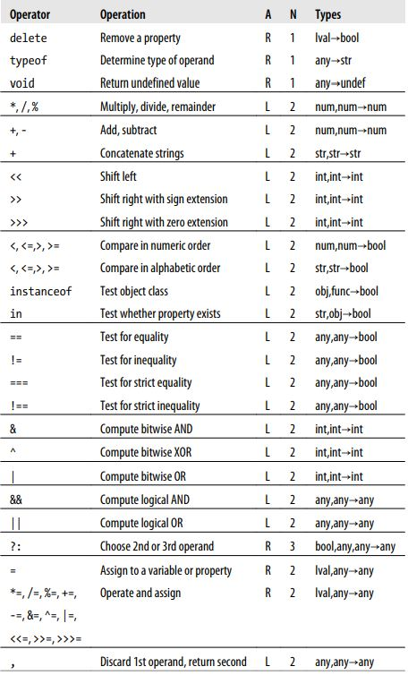

# 4장 표현식과 연산자

## 4.1 기본 표현식

자바스크립트에서 기본 표현식은 *상수, 리터럴 값, 특정 키워드들, 변수 참조* 를 말한다.

- 1.23
- "hello"
- /pattern/ (정규 표현식)
- true
- false
- null
- this
- undefined 

         리터럴(Literal) : 문자, 기호를 사용하여 값을 생성하는 표기 방식
         undefined : 선언한 후 값이 주어지지 않은 변수, 인수에 자동으로 할당
         null : 어떤 값이 의도적으로 비어있음을 표현

## 4.2 객체와 배열의 초기화 표현식

새로 생성된 객체나 배열을 값으로 하는 표현식 (객체 리터럴/ 배열 리터럴)
- 배열 ==> ( [], [1+2, 3+5], [1,,,,5], [[],[]])
- 객체 ==> ( {},{x:2, y:4},{x:{}, y:{}} ) 

## 4.3 함수 정의 표현식
새로 정의 된 함수(함수 리터럴)
- var fn = function(x) { return x * x ; }
	
## 4.4 프로퍼티 접근 표현식
객체의 프로퍼티 , 배열의 원소값
- 표현식 . 식별자  => obj.x;
-  표현식 [ 표현식 ] => array[1];

## 4.5 호출 표현식
function 이나 method를 호출하는 문법
- f(0)
- Math.max(x,y,z)
- a.sort()

## 4.6 객체 생성 표현식
새 객체를 생성하고, 생성자라고 부르는 함수를 호출해 객체에 속한 프로퍼티들을 초기화한다.
new 키워드를 사용하는 점을 제외하면 호출 표현식과 유사하다.
- new Object()
- new Point(2,3)

생성자 함수를 전달인자 없이 호출할 때, 괄호는 생략이 가능하다.

## 4.7 연산자 개요

    
    
[자바스크립트 연산자]

### 좌변값
데이터가 저장된 실제 메모리의 주소 값

### 연산자의 부수 효과
미래에 수행할 어떤 계산에서 영향을 끼치는 연산자
- 증감연산자++ 감소연산자-- delete연산자

### 연산자 우선순위
[자바스크립트 연산자]표에서 나열한 연산자들은 우선순위가 가장 높은 연산자부터 우선순위가 낮은 연산자 순서로 정렬되어 있다.
프로퍼티 접근이나 호출 표현식은 표에 나열되어 있는 연산자들보다 항상 우선순위가 높다.
실전에서 어떤 연산이 우선순위가 높은지 확실치 않을 경우 괄호를 사용해 연산 순서를 명시적으로 지정해주면 된다.

## 4.8 산술 표현식

### +연산자
- 피연산자의 값이 객체라면 객체를 원시 타입으로 바꾼다. Date 객체는 toString() 메서드에 의해 문자열로 바뀌고, 다른 객체들은 valueOf() 메서드가 원시 타입의 값을 반환하는 경우 그 반환 값으로 변경된다. 대부분의 객체는 valueOf() 메서드가 없으므로 toString() 메서드를 통해 변환된다.
- 피연산자가 하나라도 문자열이라면 다른 피연산자들을 모두 문자열로 변환한 후 이어 붙인다.
- 이 외의 경우 두 피연산자의 덧셈 연산이 수행된다.

## 4.9 관계형 연산자

- 두 피연산자 값의 관계를 검사하여 관계가 성립하면 treu, 그렇지 않으면 false를 반환한다.
- 관계형 표현식은 항상 불리언 값으로 평가된다.

## 4.10 논리 표현식
- 관계형 연산자와 마찬가지로 true 또는 false 를 반환한다.

## 4.11 할당 표현식
- = 연산자를 사용해 변수나 프로퍼티에 값을 할당한다.

## 4.12 평가 표현식
- eval() 함수 : 문자열을 자바스크립트코드로 해석하고 이를 평가한 결과를 출력하는 함수
